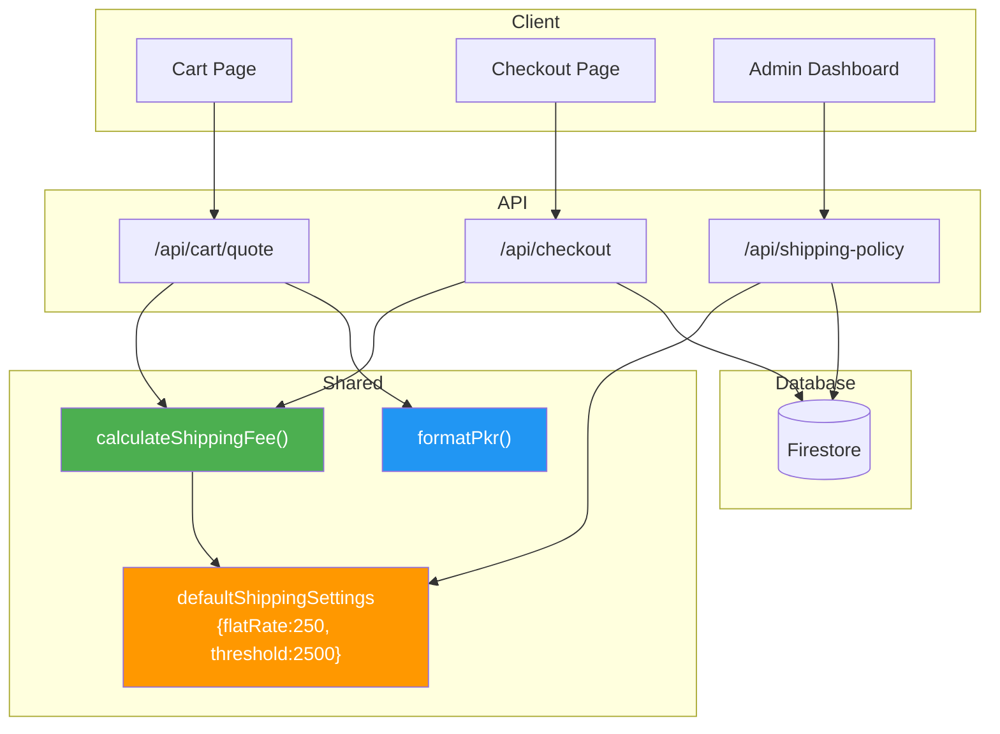
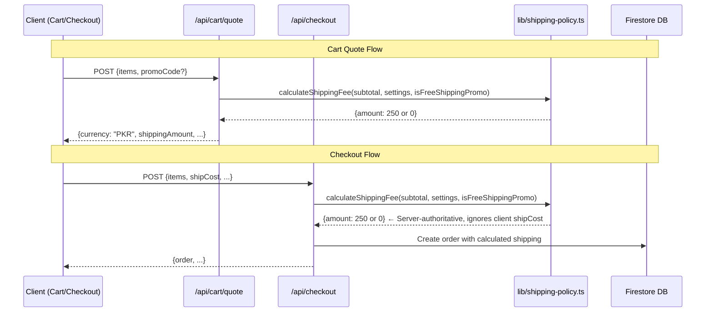

# Shipping Pricing & PKR Currency Standardization — Implementation Plan

## Overview

This plan covers two tasks: (1) standardizing shipping pricing to Rs. 250 flat / Rs. 2,500 free threshold across the entire website, and (2) verifying and fixing any remaining `$`/USD references that should use PKR formatting.

---

## Audit Summary

### ✅ Already Correct

| File | Status |
|------|--------|
| [`lib/shipping-policy.ts`](lib/shipping-policy.ts) | Defaults: `flatRate: 250`, `freeShippingThreshold: 2500` ✅ |
| [`lib/server/commerce-pricing.ts`](lib/server/commerce-pricing.ts) | Uses `calculateShippingFee()`, returns `currency: 'PKR'` ✅ |
| [`lib/storefront-settings.ts`](lib/storefront-settings.ts) | Announcement default: `FREE NATIONWIDE SHIPPING ON ORDERS OVER RS. 2,500` ✅ |
| [`lib/utils.ts`](lib/utils.ts) | `formatPkr()` outputs `Rs. 2,500` format ✅ |
| [`components/cart/CartClient.tsx`](components/cart/CartClient.tsx) | Uses server quote via `/api/cart/quote` ✅ |
| [`components/cart/CartOrderSummary.tsx`](components/cart/CartOrderSummary.tsx) | Uses `formatPkr()` ✅ |
| [`components/cart/FreeShippingProgress.tsx`](components/cart/FreeShippingProgress.tsx) | Uses `formatPkr()` ✅ |
| [`components/product/ProductPolicySummary.tsx`](components/product/ProductPolicySummary.tsx) | Shows correct Rs. text ✅ |
| [`components/admin/ShippingPolicyModule.tsx`](components/admin/ShippingPolicyModule.tsx) | PKR labels ✅ |
| [`components/admin/PromoCampaignsModule.tsx`](components/admin/PromoCampaignsModule.tsx) | Uses `formatPkr()` ✅ |
| [`app/api/cart/quote/route.ts`](app/api/cart/quote/route.ts) | Uses `calculateShippingFee(rawSubtotal, ...)` — correct ✅ |
| [`app/api/promotions/apply/route.ts`](app/api/promotions/apply/route.ts) | No dollar sign issues ✅ |
| [`app/shipping-policy/page.tsx`](app/shipping-policy/page.tsx) | Metadata correct ✅ |
| [`app/faq/page.tsx`](app/faq/page.tsx) | JSON-LD correct ✅ |
| [`app/product/[slug]/page.tsx`](app/product/[slug]/page.tsx) | Uses `currency: 'PKR'` ✅ |
| [`app/api/products/seed/route.ts`](app/api/products/seed/route.ts) | Uses `currency: 'PKR'` ✅ |
| [`app/api/products/route.ts`](app/api/products/route.ts) | Uses `currency: 'PKR'` ✅ |

### ❌ Issues Found — Need Fixing

| # | File | Line(s) | Issue | Fix |
|---|------|---------|-------|-----|
| 1 | [`app/admin/page.tsx`](app/admin/page.tsx) | 2453, 2457, 2462, 2467 | `$` signs in order invoice summary (Subtotal, Shipping, Promo, Total) | Replace with `Rs.` prefix or use `formatPkr()` |
| 2 | [`app/api/checkout/route.ts`](app/api/checkout/route.ts) | 298 | `$` sign in error message: `Minimum order of $${minOrder.toFixed(2)}` | Replace with `PKR` |
| 3 | [`app/api/shipping-policy/route.ts`](app/api/shipping-policy/route.ts) | 36-37 | POST handler defaults: `freeShippingThreshold: 5000`, `flatRate: 500` | Change to `2500` and `250` |
| 4 | [`components/policies/TermsClient.tsx`](components/policies/TermsClient.tsx) | 118 | "Shipping is FREE across Pakistan on all products" — contradicts Rs. 250/2500 rule | Update to reflect Rs. 250 / free over Rs. 2,500 |
| 5 | [`context/CartContext.tsx`](context/CartContext.tsx) | 409 | `isExpress = shipCost === 12.00` — legacy express shipping logic | Remove/clean up (no express shipping in PKR model) |

---

## Implementation Steps

### Step 1: Fix `$` signs in [`app/admin/page.tsx`](app/admin/page.tsx) — Order Invoice Section

**Lines 2453, 2457, 2462, 2467** currently use `$` prefix. Since this is a client component (`'use client'`), we can import `formatPkr` from `lib/utils.ts`.

**Changes:**
- Line 2453: `<span>${ord.subtotal?.toFixed(2)}</span>` → `<span>{formatPkr(ord.subtotal ?? 0)}</span>`
- Line 2457: `<span>{ord.shippingCost === 0 ? 'FREE' : `$${ord.shippingCost?.toFixed(2)}`}</span>` → `<span>{ord.shippingCost === 0 ? 'FREE' : formatPkr(ord.shippingCost ?? 0)}</span>`
- Line 2462: `<span>-${ord.promoDiscount?.toFixed(2)}</span>` → `<span>-{formatPkr(ord.promoDiscount ?? 0)}</span>`
- Line 2467: `<span>${ord.total?.toFixed(2)}</span>` → `<span>{formatPkr(ord.total ?? 0)}</span>`

**Import needed:** Add `import { formatPkr } from '@/lib/utils';` at top of file.

### Step 2: Fix `$` sign in [`app/api/checkout/route.ts`](app/api/checkout/route.ts)

**Line 298:** `` throw new Error(`Minimum order of $${minOrder.toFixed(2)} is required for coupon ${matchedCouponPromo.couponCode}.`); ``

**Change:** Replace `$$` with `PKR`:
`` throw new Error(`Minimum order of PKR ${minOrder.toFixed(2)} is required for coupon ${matchedCouponPromo.couponCode}.`); ``

### Step 3: Fix default values in [`app/api/shipping-policy/route.ts`](app/api/shipping-policy/route.ts) POST Handler

**Lines 36-37:**
```typescript
const freeShippingThreshold = Number(body.settings.freeShippingThreshold ?? 5000);
const flatRate = Number(body.settings.flatRate ?? 500);
```

**Change:** Match the defaults in `lib/shipping-policy.ts`:
```typescript
const freeShippingThreshold = Number(body.settings.freeShippingThreshold ?? 2500);
const flatRate = Number(body.settings.flatRate ?? 250);
```

### Step 4: Fix shipping text in [`components/policies/TermsClient.tsx`](components/policies/TermsClient.tsx)

**Line 118:** Currently says "Shipping is FREE across Pakistan on all products. There are no hidden delivery fees or minimum order thresholds."

**Change to:** "Standard shipping is Rs. 250 across Pakistan. Free nationwide shipping is available on all orders of Rs. 2,500 or more."

### Step 5: Clean up legacy express shipping logic in [`context/CartContext.tsx`](context/CartContext.tsx)

**Lines 409-417:**
```typescript
const isExpress = shipCost === 12.00;
const deliveryDays = isExpress ? 2 : 6;
const deliveryDate = new Date();
deliveryDate.setDate(deliveryDate.getDate() + deliveryDays);
const deliveryStr = deliveryDate.toLocaleDateString('en-US', {
  weekday: 'short',
  month: 'short',
  day: 'numeric',
});
```

**Change:** Remove express shipping concept. Use a fixed delivery estimate:
```typescript
const deliveryDays = 6;
const deliveryDate = new Date();
deliveryDate.setDate(deliveryDate.getDate() + deliveryDays);
const deliveryStr = deliveryDate.toLocaleDateString('en-US', {
  weekday: 'short',
  month: 'short',
  day: 'numeric',
});
```

### Step 6: Search for any remaining `$`/USD references

The search already found:
- `lib/shipping-policy.ts:1` — `'dollar'` is a valid icon type name (not currency), **no change needed**
- `components/policies/ShippingPolicyClient.tsx:8` — `dollar: Banknote` is icon mapping, **no change needed**
- `components/admin/ShippingPolicyModule.tsx:48` — `'dollar'` is icon option, **no change needed**
- `lib/storefront-settings.ts:192-195` — Legacy `$75` normalization code that handles old data, **no change needed** (it already converts to PKR)
- `scripts/execute-migration.ts` — Migration script referencing USD, **no change needed** (it's a one-time migration tool)
- `app/api/shipping-policy/seed/route.ts:8` — Seed data with `'dollar'` icon, **no change needed**

No remaining `$` currency display issues found beyond the 5 fixes listed above.

### Step 7: Run lint check and TypeScript compilation

```bash
npx next lint
npx tsc --noEmit
```

### Step 8: Run production build

```bash
npm run build
```

### Step 9: Test shipping boundary cases

Test the following scenarios via the cart/checkout flow:
1. **Empty cart** → shipping should be Rs. 0
2. **Cart subtotal < Rs. 2,500** (e.g., Rs. 1,000) → shipping should be Rs. 250
3. **Cart subtotal = Rs. 2,499** → shipping should be Rs. 250
4. **Cart subtotal = Rs. 2,500** → shipping should be FREE (Rs. 0)
5. **Cart subtotal > Rs. 2,500** (e.g., Rs. 3,000) → shipping should be FREE (Rs. 0)

### Step 10: Test free-shipping coupon

Create/apply a promotion with `discountType: 'free-shipping'` and verify:
- Cart shows Rs. 0 shipping regardless of subtotal
- Checkout API returns Rs. 0 shipping
- Order is created with Rs. 0 shipping

### Step 11: Test fake client `shipCost: 0` bypass attempt

Verify that sending `shipCost: 0` from the client for a subtotal < Rs. 2,500 is rejected by the server (checkout API recalculates shipping server-side).

### Step 12: Commit and push to GitHub

```bash
git add -A
git commit -m "fix: standardize shipping pricing to Rs. 250/2500 and fix remaining $ references"
git push
```

---

## Architecture Diagram



---

## Data Flow: Shipping Calculation



---

## Risk Assessment

| Risk | Impact | Mitigation |
|------|--------|------------|
| `formatPkr()` rounds to whole rupees (no decimals) | Low — PKR doesn't use fractional currency in practice | Acceptable; admin invoice shows clean Rs. values |
| Legacy `$75` normalization in `storefront-settings.ts` may not catch all old formats | Low | The regex handles `$75` and generic `$` patterns |
| Dual collection paths (`shipping-policy/settings` vs `shipping-policy-settings/settings`) | Medium | Migration endpoint writes to both; API reads from `shipping-policy/settings` |
| Client `shipCost` bypass | Low | Checkout API recalculates server-side and ignores client value |
